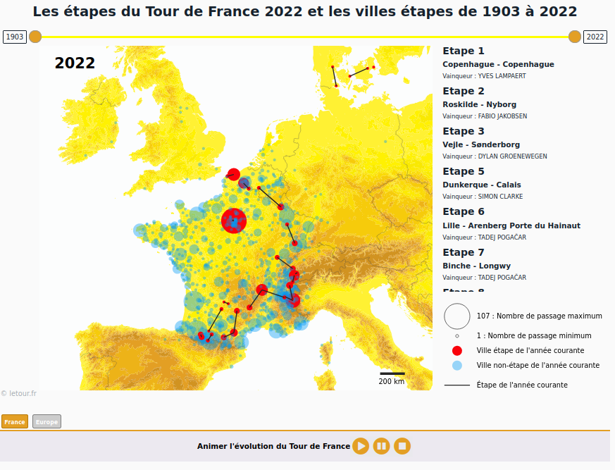

# Cartographie dynamique :Le tour de France de 1903 à 2022
*Projet réalisé dans le cadre du cours de cartographie dynamique du M2 Carthageo, par Aymeric Dutremble et Louis Peller*

## Description rapide de la carte :
Cette carte permet de visualiser, pour une année donnée, les étapes du Tour de France, ainsi que le nombre de passage du tour dans chaque ville pour une période sélectionnée.

## Réalisation technique :
Les données des étapes ont été collectées sur le site https://www.letour.fr/fr/histoire via un processus de webscraping, réalisée en langage R via la bibliothèque rvest, disponibles dans le dossier *codes_R*.

Elles ont ensuite été mises en forme et géoréférencées dans des fichiers geojson via un script python, disponibles dans le dossier *python*.

Le fond de carte est un fichier geojson provenant d’un MNT vectorisé et simplifié via QGIS et mapshaper.

La page web a été codée en langage HTML, CSS et JavaScript, et appelle la bibliothèque D3JS. La charte graphique de la page est fortement inspirée du site web https://www.letour.fr/fr/histoire.

Afin de permettre un travail en équipe efficace et le développement de plusieurs fonctionnalités en parallèle, l’ensemble de la réalisation a été stockée dans un dépôt GitHub.

Toutes les données relatives à la page web de la carte dynamique sont stockées dans le dossier *web*. Pour afficher la carte, lancer la page *index.html*.

## Présentation de l’interface :

##Fonctionnalités de la carte :
*Sélection de la plage temporelle :* Le sélecteur temporel permet à l’utilisateur de sélectionner une plage temporelle pour laquelle il veut visualiser le nombre de fois où les villes ont figuré sur le Tour de France. Elles apparaissent alors en cercles bleus sur la carte, et leur taille varie en fonction du nombre de fois où elles ont été traversées par le tour.

*Affichage des étapes : *Pour la date choisie par l’utilisateur avec le bouton de droite du sélecteur temporel, les villes et les étapes du tour de l’année seront mis en valeur, avec les villes en rouge et les étapes entre chaque ville en noir. A droite, un encart affiche toutes les étapes de l’édition du tour, et l’utilisateur peut, en survolant une étape de ce menu avec sa souris, la mettre en valeur sur la carte.

*Animation de la carte : *L’utilisateur peut également choisir de faire défiler à la suite chaque édition du Tour de France. Pour cela, il dispose d’un bouton “play” qui lui permet de lancer l’animation. Il est également possible de mettre l’animation en pause (bouton “pause”), ou de réinitialiser la carte (bouton “stop”).

*Changement d’emprise visuelle : *L’utilisateur a également la possibilité de choisir l’emprise de la carte, à savoir une emprise autour de l’Europe de l’ouest, qui permet de visualiser toutes les villes ayant accueilli le tour (en France, mais également en Allemagne, en Espagne, en Irlande, …), ou une emprise centrée sur le territoire de France métropolitaine, via deux boutons “France” et “Europe” situés sous la carte.

##Améliorations possibles :
*Changement de taille de légende :* La légende, notamment pour la taille maximum des cercles proportionnels, est adaptative en fonction de ce qui est représenté sur la carte. Cependant, lors du changement d’échelle par les boutons “France” et “Europe”, la légende ne s’adapte pas à la nouvelle échelle. En effet, elle est calibrée sur l’échelle “Europe” et ne change pas lors du zoom sur la France. Il aurait suffit, lors de l'événement clic sur un des deux boutons, de sélectionner la taille maximale du cercle présentes sur la carte. La gestion de la taille de la légende est uniquement gérée lors du déplacement du sélecteur temporel.

*Affichage des noms des villes au survol :* Afin de rendre les données plus lisibles, il pourrait être ajouté une fonctionnalité permettant d’afficher les noms des villes quand un cercle est survolé par la souris de l’utilisateur sur la carte, afin de se situer plus facilement. Cette fonctionnalité peut être facilement ajoutée en ajoutant un tooltip de type mouseover.

*Affichage des Guerres sur le sélecteur temporel :*  Dans la barre du sélecteur temporel, toutes les années sont représentées. Cependant, il serait judicieux de griser les années et mettre des marqueurs où le Tour de France n’a pas eu lieu, pendant les périodes de Guerres notamment. Cela ajouterais un visuel qui permettrait à l’utilisateur de comprendre pourquoi il n’y a pas de données avant de sélectionner ces années en question. La barre de la sélection temporelle est en réalité une div avec un fond coloré. Cela aurait été possible de calculer les ratios auxquels les périodes des guerres se trouvent sur la barre et à partir de ceux-là changer le style en créant par exemple un “grid” en fonction de ces ratios (en %) et en grisant le fond des années des guerres.

*Revoir la qualité des données :* Certaines données ne sont pas parfaites et peuvent être améliorées. Lors de la collecte, les noms des vainqueurs ont été décalés, et ne correspondent pas aux vainqueurs réels des étapes. C’est pour cela que l’on retrouve sur certaines dernières étapes. La données sur l’année 1987 est également manquante, alors que le tour a bien eu lieu cette année-là.

*Entrer l’année souhaitée à la main :* Les deux années affichées au bord du sélecteur temporel sont uniquement présentes pour savoir quelle année sélectionnée. Il serait intéressant de pouvoir modifier à la main les valeurs au lieu d’utiliser le sélecteur temporel. Cela permettrait de déterminer les années souhaitées plus rapidement. Pour ce faire, il suffit d’ajouter une balise <input> de type “text” et de récupérer l'événement lors du changement du texte dans l’input ou alors de valider par une pression sur la touche entrée du clavier.
